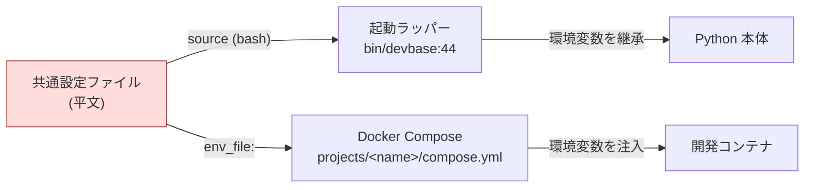
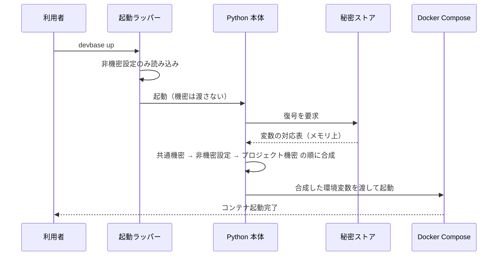

# plan35: 環境変数ファイルの暗号化方針

> 元 issue: `issues/i35.md`
> 種別: 設計方針（multi-PR 想定） / base branch: `main` / release branch: `release/PLAN35`
> ステータス: 実装中（PR 分割計画は §11 参照）

## 1. 目的

devbase が扱う認証情報（クラウドのアクセスキー、コード管理サービスの個人アクセストークン、各種 AI サービスの API キーなど）は、現在すべて平文のテキストファイルとして開発者のマシン上に置かれている。これを保存時に暗号化し、ディスク・バックアップ・同期フォルダ・誤共有の経路から機密が漏れない状態にする。

暗号処理そのものは自前実装せず、既存の OSS を組み込む。

## 2. 現状

### 2.1 平文で保存されている機密

| ファイル | 内容 | 機密性 |
|---|---|---|
| `$DEVBASE_ROOT/.env` | 全プロジェクト共通の認証情報（クラウド・コード管理・AI サービス各種） | 高 |
| `$DEVBASE_ROOT/projects/<name>/.env` | プロジェクト実行時の秘密（アプリケーションキー、データベース接続情報など） | 高 |
| `$DEVBASE_ROOT/projects/<name>/env` | プロジェクト設定（対象リポジトリ、コンテナ台数など） | 低（機密ではない） |
| `$DEVBASE_ROOT/.env.sources.yml` | 取り込み元ファイルのハッシュと同期時刻 | 低（値は含まない） |

共通設定ファイルは権限 `0600` で保存されているが、内容は平文である。

### 2.2 平文ファイルを読む 2 つの経路

暗号化を難しくしている本質は、平文ファイルを読む経路が devbase 自身の外側にもある点にある。



**起動ラッパー経由**: `bin/devbase` は起動直後に共通設定ファイルを `set -a` 付きで読み込み、ホスト側で動く処理（クラウド CLI の呼び出しなど）に環境変数として渡している。

**Docker Compose 経由**: 各プロジェクトの構成ファイルは、共通設定ファイルを直接ファイルパスとして参照している。

```yaml
env_file:
  - ${DEVBASE_ROOT}/.env
  - env
  - .env
```

Docker Compose はこのファイルを暗号文のまま読み、値として扱ってしまう。したがって**ファイルを暗号化するだけでは、コンテナに壊れた値が入って起動が失敗する**。この 2 経路の切り替えが本方針の中心課題になる。

### 2.3 平文が滞留する副次経路

暗号化の対象を主ファイルだけに絞ると、以下が取り残される。

- **設定取り込み時のバックアップ**: `$DEVBASE_ROOT/backups/env-import/<日時>/` に、上書き前の平文コピーが残る（世代 GC はあるが平文のまま）
- **除外設定の穴**: 除外設定（`.gitignore`）には `.env` / `.env.bak` / `.env.backup` の 3 つが列挙されているが、日時付きの手動バックアップは対象外である。実際に日時付きの平文バックアップが未追跡ファイルとして検出されている

  ```console
  $ git check-ignore -v .env .env.bak .env.bak-20260807172231
  .gitignore:3:.env	.env
  .gitignore:4:.env.bak	.env.bak
  ```

  3 番目のファイルは出力に現れない = 除外されない。この状態でコミットすれば、平文の認証情報がリポジトリ履歴に残る。

## 3. 技術選定

### 3.1 決定

**保存形式は age を標準とし、暗号処理の呼び出し口を差し替え可能な層として設ける。** 既定の実装には既存の Python バインディング（`pyrage`）を使い、外部バイナリを必要としない。チーム運用や鍵管理サービス連携が要るときのために、SOPS を選べる差し替え先として設計に織り込む。

### 3.2 比較

| 候補 | 強み | devbase での評価 |
|---|---|---|
| **age（Python バインディング経由）** | 追加インストール不要。ファイル単位で堅牢。複数受信者に対応 | **標準採用**。すでに依存関係に含まれ、設定の書き出し・取り込み機能で実績がある |
| **SOPS + age** | 値だけを暗号化し変数名は可読。受信者の追加・削除と鍵更新の専用コマンドを持つ。鍵管理サービスへ移行可能 | **差し替え先として採用**。ただし別途バイナリの導入が必要なため既定にはしない |
| **dotenv 拡張ツール** | 導入と操作が平易 | 不採用。実行中コンテナに後から接続して作業する使い方と噛み合わない |
| **サーバー型の秘密管理サービス** | 権限管理・監査ログ・履歴・自動更新 | 将来の選択肢。サーバーと認証基盤を必要とし、ローカル開発ツールの既定としては重い |
| **Git 透過暗号化ツール** | リポジトリ内ファイルの透過的な暗号化 | 不採用。対象ファイルはリポジトリ管理外であり、作業ファイルは平文で置かれる |

### 3.3 標準を age に置く理由

**追加インストールを増やさない。** devbase は 1 行のコマンドで導入でき、Python の依存関係は実行時に自動解決される。暗号化を既定で有効にする以上、その前提条件も同じ水準で自動的に満たされる必要がある。SOPS を標準にすると、全利用者が別途バイナリを導入し、macOS・Linux・WSL それぞれで版を管理することになる。

```console
$ grep -n "pyrage" pyproject.toml
8:    "pyrage>=1.2",

$ command -v sops age age-keygen
（出力なし = いずれも未導入）
```

**値単位の暗号化が効く場面が限定的。** 値だけを暗号化する形式の主な利点は、リポジトリ上で「どの変数が変わったか」を差分で追えることにある。対象ファイルはリポジトリ管理外の端末ローカル状態であり、この利点はほとんど働かない。

**変数単位の操作層はすでに存在する。** 設定の追加・取得・削除・編集は既存の解析処理が担っており、暗号化は「読み込み直後」と「書き出し直前」に差し込むだけで成立する。ファイル全体の暗号化でも操作性は落ちない。

## 4. 目標構成

### 4.1 ファイル配置

機密と非機密を分離する。

```
$DEVBASE_ROOT/
├── env                      # 共通の非機密設定（平文のまま）
├── secrets/
│   ├── global.env.age       # 共通の機密（暗号化）
│   └── projects/
│       └── <name>.env.age   # プロジェクトの機密（暗号化）
└── projects/
    └── <name>/
        ├── env              # プロジェクト設定（平文のまま）
        └── compose.yml
```

### 4.2 読み込みフロー

**恒久的な平文ファイルを作らない。** 復号結果はプロセスのメモリ上だけで合成し、子プロセスの環境変数として渡す。



優先順位は現行の重ね順を維持する。共通の機密を土台に、プロジェクトの非機密設定、プロジェクトの機密の順で上書きする。

### 4.3 コンテナへの受け渡し

各プロジェクトの構成ファイルから機密ファイルの参照を外し、非機密設定だけを残す。

```yaml
services:
  dev:
    env_file:
      - env
```

機密は、devbase が起動時に生成する上書き構成ファイルで**変数名だけを列挙**して渡す。値を持たない列挙は、Docker Compose を実行しているプロセスの環境変数から解決される。

```yaml
services:
  dev:
    environment:
      - ANTHROPIC_API_KEY
      - AWS_SECRET_ACCESS_KEY
```

この形なら、暗号文も平文ファイルも Docker Compose に渡らない。上書き構成ファイル自体にも値は含まれない。

### 4.4 起動ラッパーの扱い

起動ラッパーは非機密設定だけを読み込むよう変更し、機密は Python 本体が必要になった時点で復号する。ホスト側で動く処理のうち機密を必要とするものを事前に洗い出し、それぞれ Python 側から環境変数を渡す形へ移す。この洗い出しを実装前の必須作業とする（対象は主にクラウド CLI の呼び出し系）。

## 5. 鍵管理

### 5.1 devbase 専用鍵を開発者ごとに作る

SSH 鍵の流用は技術的には可能だが、失効・保管・バックアップの扱いが署名用の鍵とは異なるため、専用鍵を分けて作る。

```bash
mkdir -p ~/.config/devbase/age && chmod 700 ~/.config/devbase/age
age-keygen -o ~/.config/devbase/age/keys.txt
chmod 600 ~/.config/devbase/age/keys.txt
```

鍵ファイルの場所は環境変数で明示的に統一し、OS ごとの既定位置の違いを吸収する。鍵の生成は `devbase env keygen` として devbase 側に取り込み、外部コマンドの導入を利用者に要求しない。

### 5.2 保護の強度を選べるようにする

| 段階 | 鍵の保管 | 守れる範囲 |
|---|---|---|
| 既定 | パスフレーズなしの鍵ファイル（`0600`） | バックアップ・同期フォルダ・誤共有・端末の紛失 |
| 強化 | OS の資格情報ストア（macOS のキーチェーン、Linux の秘密情報サービス、Windows の資格情報マネージャー） | 上記に加え、ファイル読み取りのみを持つ攻撃者 |
| チーム | 各人の公開鍵を受信者として登録 | 秘密鍵を共有せずに同じファイルを共同利用 |

既定の段階は「鍵が錠前の隣にある」状態であり、端末上で利用者権限を得た攻撃者は防げない。これは実運用上の妥協として明示する。

### 5.3 鍵を失ったときの備え

暗号化した機密は、鍵を失えば復旧できない。以下を必須とする。

- 暗号化を有効にする操作の中で、鍵のバックアップを促す確認を入れる
- 復旧用の受信者（パスワード管理ツールなどに保管する予備の公開鍵）を登録できるようにする
- 平文へ戻す退避コマンドを用意する

## 6. コマンド

既存の操作性は変えず、保存先だけを差し替える。

| コマンド | 変更内容 |
|---|---|
| `devbase env init` / `sync` / `set` / `get` / `delete` / `edit` / `list` | 保存先を秘密ストアに変更。操作は現行のまま |
| `devbase env keygen` | 新設。専用鍵の生成と設定 |
| `devbase env encrypt` | 新設。平文から暗号化構成へ移行 |
| `devbase env decrypt` | 新設。平文へ戻す退避 |
| `devbase env rekey` | 新設。受信者の追加・削除と再暗号化 |
| `devbase env doctor` | 新設。端末上に残る平文の走査と除外設定の点検 |
| `devbase env export` / `import` | 既存の書き出し・取り込みは暗号化済みの機密をそのまま持ち運ぶ形に整理 |

## 7. 脅威モデル

**守れるもの**: 端末のディスク上に残る保存ファイル、バックアップ、クラウド同期フォルダ、ファイル転送中、リポジトリへの誤コミット、画面共有時の誤表示。

**守れないもの**:

- **実行時の平文化**: 最終的にコンテナへは環境変数として平文で渡る
- **コンテナ環境の可視性**: コンテナの詳細情報を参照する権限があれば、注入済みの環境変数は読める。devbase は開発コンテナに Docker の制御ソケットを渡す構成を既定に含むため、**コンテナ内から他コンテナの環境変数も参照できる**
- **構成の展開結果**: 構成の確認コマンドは変数名だけの列挙を実際の値へ解決して表示する
- **利用者権限を得た攻撃者**: 既定の鍵保管では鍵も同時に読める

実行時の露出を下げる手段（コンテナの秘密情報機能によるファイル渡し、クラウドの一時認証、認証エージェントの転送）は、本方針の範囲外として将来の課題に置く。

## 8. 段階実装

| 段階 | 内容 | 完了条件 |
|---|---|---|
| 1 | 秘密ストアの抽象層と age 実装、鍵の生成・登録 | 暗号化ファイルに対して読み書きが通り、既存テストが退行しない |
| 2 | 設定操作コマンド群の保存先切り替え | 追加・取得・削除・編集・一覧が暗号化構成で動作する |
| 3 | 起動ラッパーの機密読み込み廃止とホスト側処理の移行 | 機密を必要とするホスト側処理の一覧と移行が完了する |
| 4 | 変数名のみを列挙する上書き構成の生成、既存プロジェクト構成の移行 | 平文ファイルを介さずにコンテナへ機密が渡る |
| 5 | 移行・退避・受信者更新・平文走査の各コマンド、除外設定の修正 | 平文から暗号化への往復が非破壊で完了する |
| 6 | 差し替え先としての SOPS 実装、ドキュメント整備 | 同じ操作性で保存形式だけを切り替えられる |

段階 4 までで保護の目的は達成される。段階 6 は運用要件が出てから着手してよい。

## 9. 移行と後方互換

- **自動判定**: 暗号化ファイルがあればそれを使い、無ければ平文を使う。両方ある場合はエラーで停止し、利用者に解消させる
- **既存プロジェクト構成の書き換え**: 各プロジェクトの構成ファイルにある機密ファイル参照を移行コマンドで除去する。利用者が独自に編集した構成も検出できるよう、書き換え前に差分を提示する
- **平文の後始末**: 移行完了後、元の平文ファイルと取り込み時のバックアップを削除対象として提示する。無言で消さず、削除するまでは警告を出し続ける
- **除外設定の修正**: 日時付きバックアップと秘密ディレクトリを除外対象へ追加する

## 10. 未確認事項・残リスク

- **値を持たない変数名の列挙の挙動**: 実行プロセス側で変数が未設定だった場合に、Docker Compose の版によって警告のみか失敗かが分かれる可能性がある。実装前に対象版で確認する
- **ホスト側処理の機密依存範囲**: 起動ラッパーが読み込んだ環境変数に依存する処理を全件は洗い出せていない。段階 3 の着手時に、機密を必要とする処理の一覧化を先に行う
- **コンテナ台数を増やした構成での上書き順序**: 台数拡張時に生成される構成ファイルと、機密を渡す上書き構成の適用順序は未検証
- **復号の実行回数**: 現在は devbase の実行ごとに設定ファイルを読み込んでいる。復号を毎回行う場合の所要時間は未計測であり、体感が悪ければ実行単位での保持を検討する
- **バックアップ機能との関係**: バックアップ取得がボリューム内の機密を平文で保存するかは未確認

## 11. PR 分割計画

release branch: `release/PLAN35` / base branch: `main`

| PR # | branch 名 | 概要 | 対応する段階 | 依存 | 並行可否 |
|---|---|---|---|---|---|
| 1 | `feature/PLAN35-secret-store` | 秘密ストアの抽象層 + age 実装 + 鍵生成 (`devbase env keygen`) と受信者管理 | 段階 1 | なし | ○ |
| 2 | `feature/PLAN35-env-commands` | 設定操作コマンド群 (`init`/`sync`/`set`/`get`/`delete`/`edit`/`list`) の保存先切替、`encrypt`/`decrypt` 移行コマンド | 段階 2・5(移行) | PR1 | × |
| 3 | `feature/PLAN35-runtime` | 起動ラッパーの機密読み込み廃止、`env exec` によるホスト側処理への注入、変数名のみを列挙する構成生成、プロジェクト構成の移行 | 段階 3・4 | PR2 | × |
| 4 | `feature/PLAN35-ops-docs` | `rekey` / `doctor`、除外設定の修正、取り込みバックアップの暗号化、ドキュメント | 段階 5(残り) | PR3 | × |

段階 6 (SOPS を差し替え先として実装) は本 release のスコープ外とし、運用要件が出た時点で別 plan に切り出す。

### 11.1 依存が直列になる理由

4 本すべてが `lib/devbase/env/` の同一層を触るため、worktree による並行開発の利得よりコンフリクト解消のコストが上回る。PR1 の抽象層が確定しないと PR2 の保存先切替は書けず、PR2 の読み込み経路が確定しないと PR3 の注入経路は書けない。したがって「PR n を release へ merge → PR n+1 を release から切る」の直列で進める。

### 11.2 ホスト側で機密を必要とする処理の洗い出し（段階 3 の必須事前作業）

`bin/devbase` が `set -a; source $DEVBASE_ROOT/.env` で読み込んだ値に依存するホスト側処理は、実測で以下の 2 系統のみだった。

```console
$ grep -rhno '\${[A-Za-z_][A-Za-z0-9_]*[^}]*}' projects/*/compose.yml | sed 's/^[0-9]*://' | sort | uniq -c | sort -rn
  84 ${DEVBASE_ROOT}
  43 ${DOCKER_GID}
  12 ${DB_PASSWORD:-password}
   8 ${COMPOSE_PROJECT_NAME}
   ...
   1 ${AWS_SECRET_ACCESS_KEY:-localpassword}
   1 ${AWS_ACCESS_KEY_ID:-localid}
```

| 経路 | 機密への依存 | 移行方法 |
|---|---|---|
| Docker Compose の変数展開 | `AWS_ACCESS_KEY_ID` / `AWS_SECRET_ACCESS_KEY` (ローカル S3 互換サービスの資格情報として展開される) | Python 本体が復号結果を自プロセスの環境変数へ載せてから Compose を起動する |
| 起動ラッパーのビルド処理 | 上と同じ変数を `docker compose build` が展開しうる | ラッパーから `devbase env exec -- docker compose build ...` 経由で呼び、Python 側で注入する |
| 設定収集 (クラウド CLI 呼び出し) | ホームディレクトリ配下の設定ファイルを直接読むため、環境変数への依存なし | 変更不要 |

`DEVBASE_ROOT` / `DOCKER_GID` / `COMPOSE_PROJECT_NAME` は機密ではなく、ラッパーが従来どおり自前で設定する。プロジェクトごとの `DB_PASSWORD` 等はプロジェクトの `.env` に属し、共通設定ファイルの読み込み廃止とは独立である。
